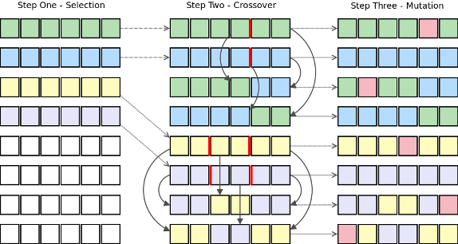
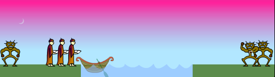
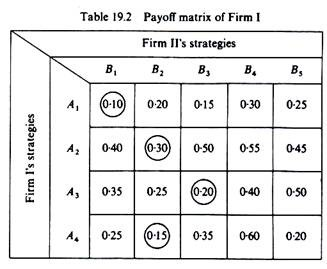
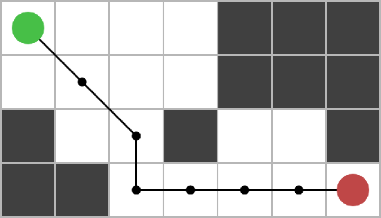
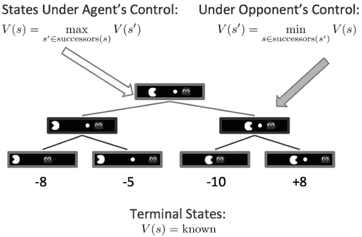
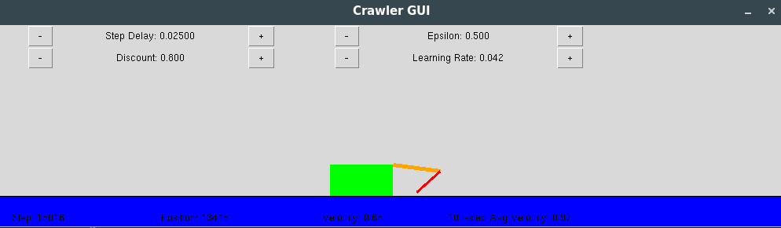

# AI-programming

This repository has different versions of the Pacman game, using different Artificial Intelligence algorithms and strategies, and some other AI related scripts I made in python.

### *Miscelaneous*

- *genetic_pwdcrack.py*

    A simple genetic algorithm implementation to crack a password.

    
 

- *missionaries.py*

    Solves the classical Missionaries and Cannibals puzzle, using a BFS search.

    
 

- *zero_sum_game.py*

    Obtain the equilibrium of a two-player zero sum game (if it has one), and find the optimal (pure) strategy for both players.

 

### *Pacman*

 

Pacman is a very famous game, and here it was used as a playground for applying Artificial Intelligence techniques. The code from the Pacman game is from Berkeley, and it uses Python 2.7. There are three different parts in this Pacman project, divided in three folders:

- **search-agents**

In the *search-agents* folder, I implemented four different Pacman agents, each using a different search algorithm. The implementation is defined in the file **search.py**. The four agents use the following algorithms: **Breadth First Search** (BFS), **Depth First Search** (DFS), **Iterative Deepening Search** (IDS), and finally the **A-star** algorithm. By running the Pacman with different agents, we can then compare the time taken to calculate the path, number of nodes explored, and other interesting statistics comparing these classical search techniques.

 

- **multiagents**

In the *multiagents* folder, I implemented classical algorithms based in Game Theory. The agents implemented this time used the **Minimax** algorithm, the **Expectimax** algorithm, and then I implemented the **Alpha-Beta Prunning** for both Minimax and Expectimax algorithms, to reduce the number of nodes in the game tree that needed to be explored. The implementation of each of these agents is in the **multiAgents.py** file.

 

- **reinforcement-learning**

In the *reinforcement-learning* folder, I implemented some *Reinforcement Learning* techniques, and some model evaluation for policy extraction using Value Iteration. The Value Iteration needs a defined MDP (Markov Decision Process) to reach the optimal policy. The algorithm implemented for Reinforcement Learning is the **Q-Learning**, which is one of the most used in the area. It learns the optimal values of each Q-state, and then we can extract the optimal actions in a given state, obtaining very good performance with the Pacman. Since the implementation is not just for the Pacman, there's a Crawler app that uses the Q-learning to learn how to move.

 

