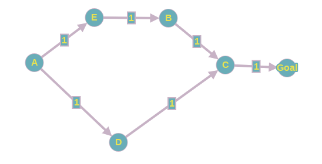

[//]: # pandoc -s -o teste.pdf relatorio.md  && evince teste.pdf
### Questões

1. (DFS) A ordem de exploração foi de acordo com o esperado? O Pacman realmente passa por todos os estados explorados no seu caminho para o objetivo?

    A ordem de exploração foi de acordo com o esperado. A DFS seguiu a ordem reversa, por causa da Pilha. Não, o Pacman não passa por todos os estados explorados, porque nem todos os estados explorados fazem parte do caminho para a solução. Um nó pode ser explorado, mas dar em uma parede, então a DFS terá que voltar um nível de profundidade e continuar a partir daquela profundidade, e assim em diante.

2. (DFS) Essa é uma solução ótima? Senão, o que a busca em profundidade está fazendo de errado?

    Não é uma solução ótima, o caminho é bem maior do que o necessário. A busca em profundidade termina quando encontra o objetivo, mas o faz de forma que não leva em consideração o comprimento até o objetivo. A DFS não dá garantia nenhuma de que o caminho que foi encontrado é realmente o caminho ótimo. Então, na verdade, a DFS não está fazendo nada de errado, ela simplesmente funciona assim.

3. A busca BFS encontra a solução ótima? Por quê? Se não, verifique a sua implementação.

    Encontra. Nesse problema em específico, o custo de cada ação é sempre 1, então a BFS é ótima. Se o custo da ação fosse diferente, não teríamos garantia de que a solução ótima seria encontrada. Pelo fato de que a ação é sempre 1, a ordem que a BFS explora os nós é na ordem dos nós de menor custo (neste problema em específico), então se encontrar o nó objetivo, temos certeza de que neste momento, não há nenhum outro caminho menor até esse nó objetivo, portanto, essa é a solução ótima.

4. por que a busca IDS não é ótima em busca em grafo (sem a modificação)? Por que se torna ótima adaptando a maneira de descartar nós da busca em grafo? Por que para os problemas de busca estudados neste EP não é aconselhável implementar o algoritmo IDS com busca em árvore?

    A busca IDS não é ótima em busca em grafo porque em um grafo, um vértice pode ter grau de entrada maior que 1, ou seja, vários nós podem estar apontando para um vértice. Assim, na DFS, se um nó já foi visitado, ele não poderia ser expandido novamente. O grafo da figura 1 exemplifica esse problema.

    

    Ao modificar o IDS, permitindo revisitar um nó que já foi visitado se o custo até ele é menor do que o menor custo que já foi possível visitá-lo, isso garante que, em uma profundidade $d$, o caminho até o nó $C$ será o menor possível. Assim, mantemos o invariante de que temos o menor custo até o momento, não apenas o "primeiro custo que foi encontrado pela DFS", que seria o caso sem a modificação.

    Não é usar IDS primeiramente porque o problema que estamos tratando não se trata de uma árvore, mas sim de um grafo que não satisfaz as condições para ser uma árvore, logo o IDS *puro* não é ótimo. 

5. Você deve ter percebido que o algoritmo A* encontra uma solução mais rapidamente que outras buscas. Por quê? Qual a razão para se implementar uma heurística consistente para sua implementação da busca A*?

    A razão do A* ser mais rápido é que, dado que a heurística é admissível, os nós serão explorados na ordem de menor custo real + heurística, assim o algoritmo não vai perde tempo expandindo nós cujo custo seja alto, o que acontece no caso da BFS. A razão para se implementar uma heurística consistente é para garantir que um nó só será visitado apenas uma vez. Se a heurística não for consistente, então os comprimentos dos caminhos na ordem de visitação poderiam decrescer (ou seja, se já temos um caminho até $C$ com custo $k$, pode ser que encontrássemos um outro caminho até $C$ com custo $y$, onde $y < k$). Se não temos caminhos não decrescentes, o algoritmo A* não é ótimo (em grafos), porque um mesmo nó pode ter grau de entrada maior que 1, logo pode ser que seja encontrado um caminho para o objetivo que não seja o ótimo, uma vez que não há garantia de que o caminho encontrado é o menor deles.

6. O que acontece em openMaze para as várias estratégias de busca?

    A DFS encontra um caminho claramente não ótimo, simplesmente porque a visitação dos nós se dá em profundidade, e no openMaze é possível visitar vários nós seguindo uma profundidade. A BFS encontra um caminho ótimo, e neste mapa, expande menos nós que a DFS.
    O IDS também encontra um caminho ótimo, porém visita muito mais nós, e o tempo de cálculo é consideravelmente mais longo que as outras estratégias. Apesar do caminho calculado pelo IDS ser ótimo, é diferente do encontrado pela BFS, primeiro porque neste problema é possível ter mais de um caminho ótimo, e também porque a ordem de visitação dos nós é o inverso do que a BFS faz, já que no IDS a ordem é dada pela mesma ordem da DFS (ordem inversa). Por fim, o A* também encontra um caminho ótimo, visita uma quantidade de nós similar à BFS. Isto quando utilizamos o A* com uma heurística admissível e consistente (como a nullHeuristic ou manhattanHeuristic).
